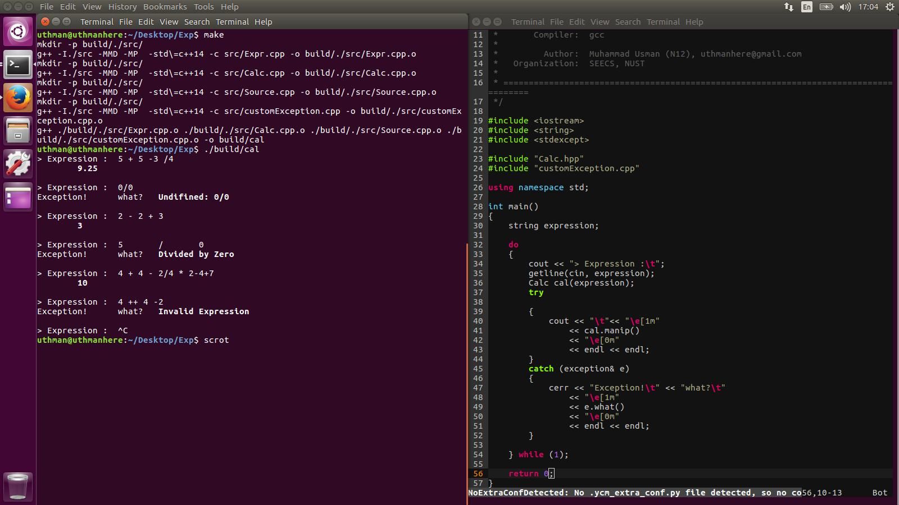

# The Expression Evaluator
Evaluates the expression through a very friendly 
and readable C++ Object Oriented design. 

## Exit
Press the **EOF** character :
	
	$ C+c
	
to exit.

## Installation
On commandline, run :

	make
		
to make **build** directory containing the executable.
Run the program using :
	
	./build/cal
	
## Code
### Classes
- Expr
- Calc
### Files
- Source.cpp
- Calc.hpp
- Calc.cpp
- Expr.hpp
- Expr.cpp

## Screenshot

## Supervisor
Sir **Tariq Saeed** <tariq@rcms.nust.edu.pk>
